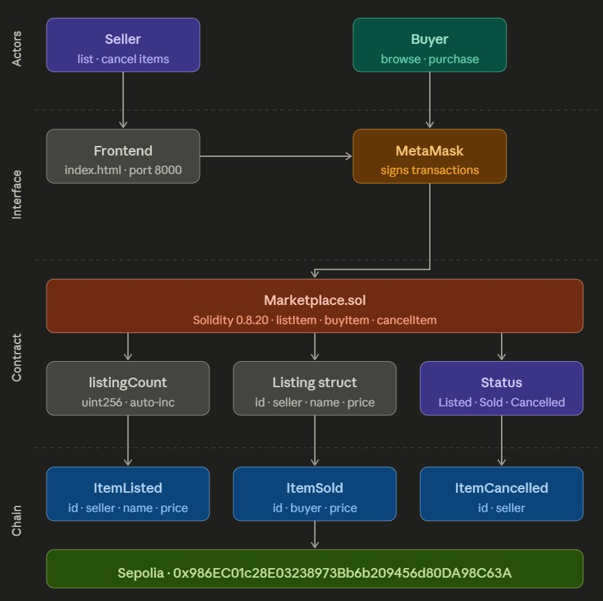

# Marketplace Decentralized Application

## Description

This application is built in Solidity and deployed on the Sepolia testnet. Users can list items for sale, browse listings, purchase active listings, and cancel their own listings. Each listing has a distinct status (Listed, Sold, or Cancelled) and all activities are recorded on-chain through events.

---

## System Architecture



---

## Contract Summary

### State Variables

| Variable | Type | Visibility | Description |
|---|---|---|---|
| `listingCount` | `uint256` | private | Auto-incrementing ID counter for listings |
| `listings` | `Mapping (uint256 => Listing)` | private | Maps listing ID to Listing struct |

### Enum: Status

| Value | Meaning |
|---|---|
| `Status.Listed` | Item is available for purchase |
| `Status.Sold` | Item has been purchased |
| `Status.Cancelled` | Item was cancelled by the seller |

### Listing Struct

| Field | Type | Description |
|---|---|---|
| `id` | `uint256` | Unique listing identifier |
| `seller` | `address payable` | Address of the seller |
| `name` | `string` | Item name |
| `price` | `uint256` | Price in wei |
| `status` | `Status` | Current state of the listing |

### ListingView Struct *(returned by read functions)*

| Field | Type | Description |
|---|---|---|
| `id` | `uint256` | Unique listing identifier |
| `name` | `string` | Item name |
| `price` | `uint256` | Price in wei |
| `status` | `Status` | Current state of the listing |

### Functions

| Function | Type | Description |
|---|---|---|
| `listItem(name, price)` | write | Create a new listing; emit `ItemListed` |
| `buyItem(id)` | write + payable | Buy a listing; transfers ETH to seller; emit `ItemSold` |
| `cancelItem(id)` | write | Cancel seller's own listing; emit `ItemCancelled` |
| `ActiveListings()` | view | Return all listings with status `Listed` |
| `SoldListings()` | view | Return all listings with status `Sold` |
| `CancelledListings()` | view | Return all listings with status `Cancelled` |

### Events

| Event | Emitted When |
|---|---|
| `ItemListed(id, seller, name, price)` | A new item is listed |
| `ItemSold(id, buyer, price)` | An item is sold |
| `ItemCancelled(id, seller)` | A listing is cancelled by the seller |

### Validations

| Location | Rule |
|---|---|
| `listItem` | Price must be greater than zero |
| `listItem` | Item name cannot be empty |
| `buyItem` | Item status must be `Listed` |
| `buyItem` | Buyer cannot be the seller |
| `buyItem` | Exact ETH amount must be sent |
| `cancelItem` | Item status must be `Listed` |
| `cancelItem` | Only the original seller can cancel |

---

## How to Compile, Deploy, and Run (Remix + MetaMask)

### Prerequisites

- **Remix IDE**: https://remix.ethereum.org
- **MetaMask** browser extension with at least two accounts funded with Sepolia ETH: https://metamask.io/download
- **Faucet**: https://cloud.google.com/application/web3/faucet/ethereum/sepolia

---

### Step 1 — Upload the Contract

1. Open https://remix.ethereum.org
2. In the **FILE EXPLORER**, upload the file `Marketplace.sol` to the `contracts` folder

### Step 2 — Compile

1. Click the **Solidity Compiler** tab (left sidebar)
2. Set compiler version to `0.8.20` (or above)
3. Click **Compile Marketplace.sol**
4. Confirm: no errors in the output panel

### Step 3 — Deploy to Sepolia

1. Click the **Deploy & Run Transactions** tab
2. Under **Environment**, select `Browser Extension: Sepolia Testnet - MetaMask`
3. Connect your wallet and switch to Sepolia
4. Confirm the correct account is selected
5. Under **Deploy**, select `Marketplace`
6. Click **Deploy**
7. MetaMask will pop up — confirm the transaction
8. Once confirmed, the contract appears under **Deployed Contracts**

### Step 4 — List an Item *(Seller Account)*

1. In **Deployed Contracts**, find `Marketplace` and expand it
2. Find `listItem`
3. Enter item name and item price (unit = 1 wei)
4. Click **transact** and confirm in MetaMask
5. Check the Remix terminal — you should see the `ItemListed` event in the logs
6. Repeat to list more items if needed

### Step 5 — Verify Active Listings

1. Find `ActiveListings`
2. Click **call** (free, no gas)
3. Confirm listed items appear

### Step 6 — Buy an Item *(Buyer Account)*

1. Switch MetaMask to a **different account** — sellers cannot buy their own listings
2. Find `buyItem`, enter the `id` and `price` of the item you want to buy
3. Click **transact** and confirm in MetaMask
4. Check the Remix terminal for the `ItemSold` event
5. Call `ActiveListings` — the sold item should be gone
6. Call `SoldListings` — the sold item should appear
7. The transaction can also be verified in MetaMask and the block explorer

### Step 7 — Cancel a Listing *(Seller Account)*

1. Switch MetaMask back to the **seller account** — listings can only be cancelled by their sellers
2. Find `cancelItem`, enter the `id` of the item you want to cancel
3. Click **transact** and confirm in MetaMask
4. Call `ActiveListings` — the cancelled item should be gone
5. Check the Remix terminal for the `ItemCancelled` event
6. Call `CancelledListings` — the cancelled item should appear
7. The transaction can also be verified in MetaMask and the block explorer

---

## Testnet

**Sepolia**

---

## Deployed Contract

| Field | Value |
|---|---|
| Network | Sepolia |
| Contract Address | `0x986EC01c28E03238973Bb6b209456d80DA98C63A` |
| Deployment TX | [View on Etherscan](https://sepolia.etherscan.io/tx/0x3cb10313eea37475f9318d27b383e3c085d8edfdc5a71a1c5d7118363463222f) |
| Interaction TX (`listItem`) | [View on Etherscan](https://sepolia.etherscan.io/tx/0x07f27757d7fd8ef6e2f62d7ecd940705af3ce10c42a991212d5d5d6f372ff6d0) |
| Interaction TX (`buyItem`) | [View on Etherscan](https://sepolia.etherscan.io/tx/0xfe21e7826def7e04a9640e4547357a746b464b6ce026121df347a59a9120185c) |
| Interaction TX (`cancelItem`) | [View on Etherscan](https://sepolia.etherscan.io/tx/0x86ad76e28f3be00447d0e8cc5ebd0295bdeb85c613922f01a08a7c16e8468d9c) |

---

## How to Use the Frontend

### Step 1 — Run the Frontend with a Web Server *(Python)*

1. Open the Python Command Prompt
2. Navigate to the folder where `index.html` is located
3. Start the Python web server:
   ```bash
   python -m http.server 8000
   ```
4. Open a browser and go to: http://localhost:8000

### Step 2 — Configure Contract Address and Wallet Address

1. Click the **Settings** button
2. Enter the **contract address**
3. Enter the **wallet address**
4. Click **Save & Apply**

### Step 3 — Interact with the Contract

> **Notice:** Sellers cannot buy their own listings, and listings can only be cancelled by their sellers. Switch to the appropriate MetaMask account before performing these operations.
